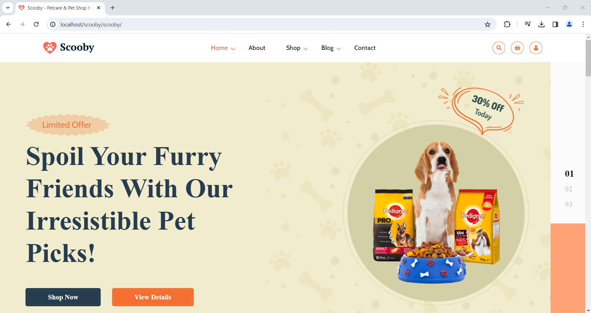
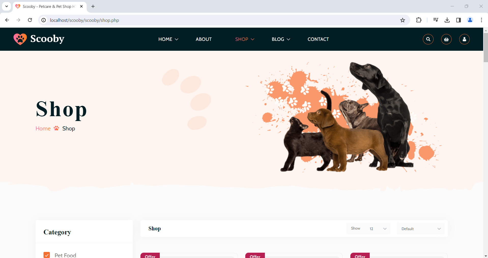
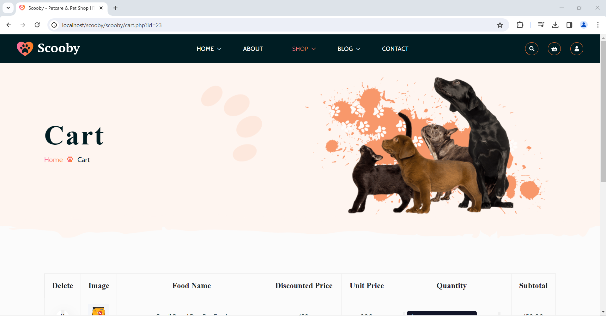
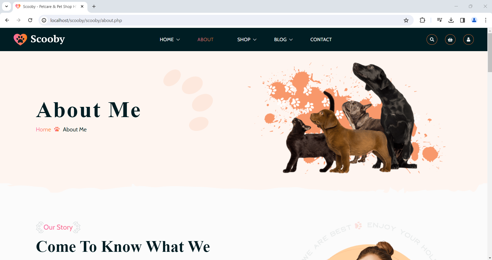
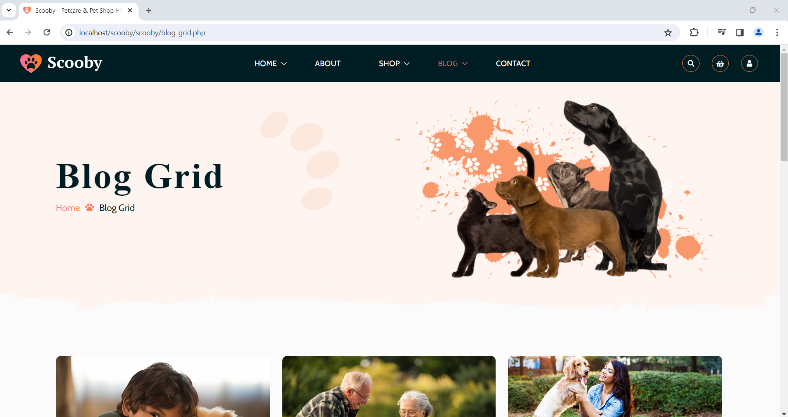
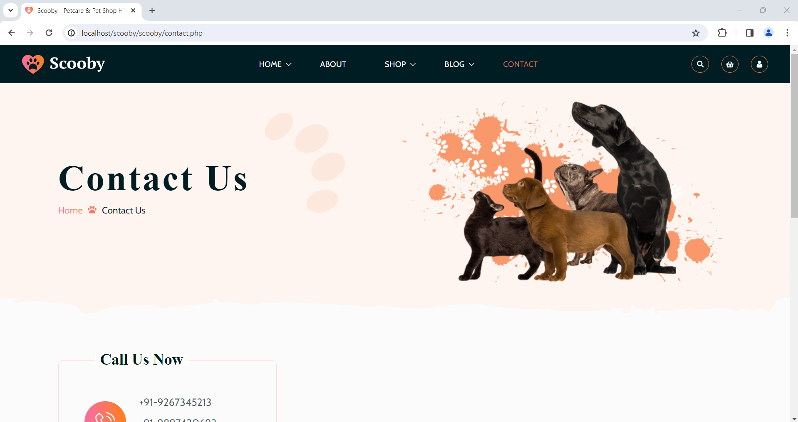
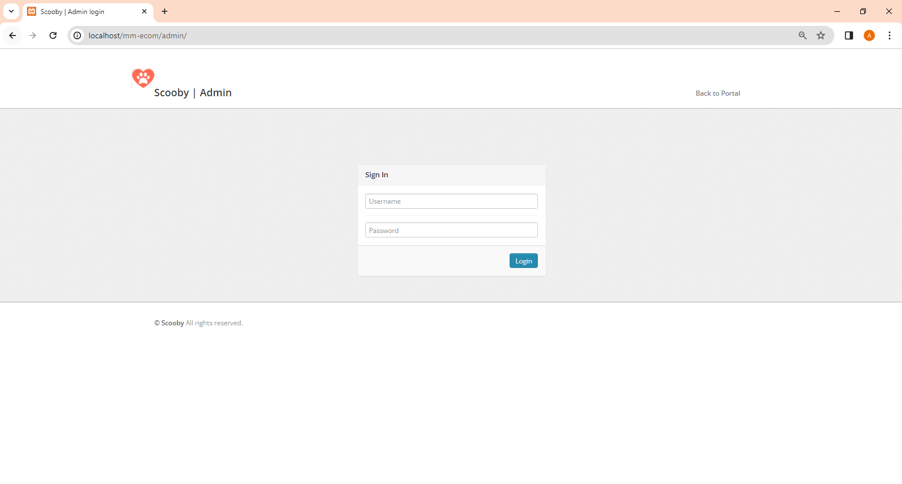
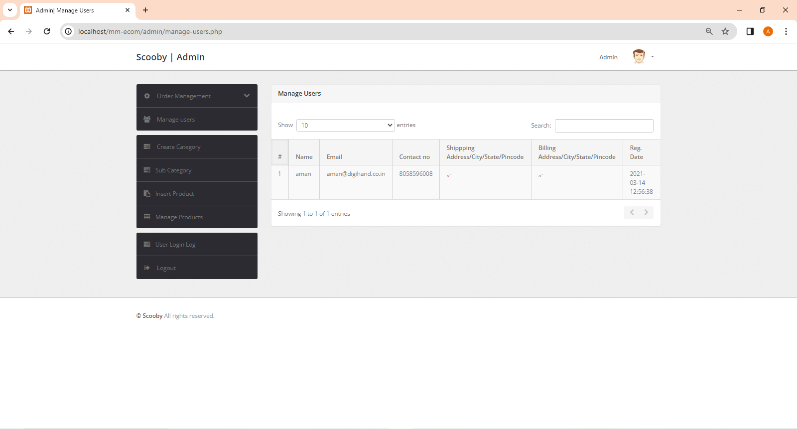
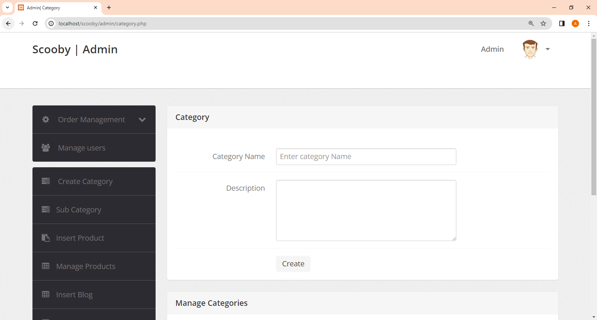
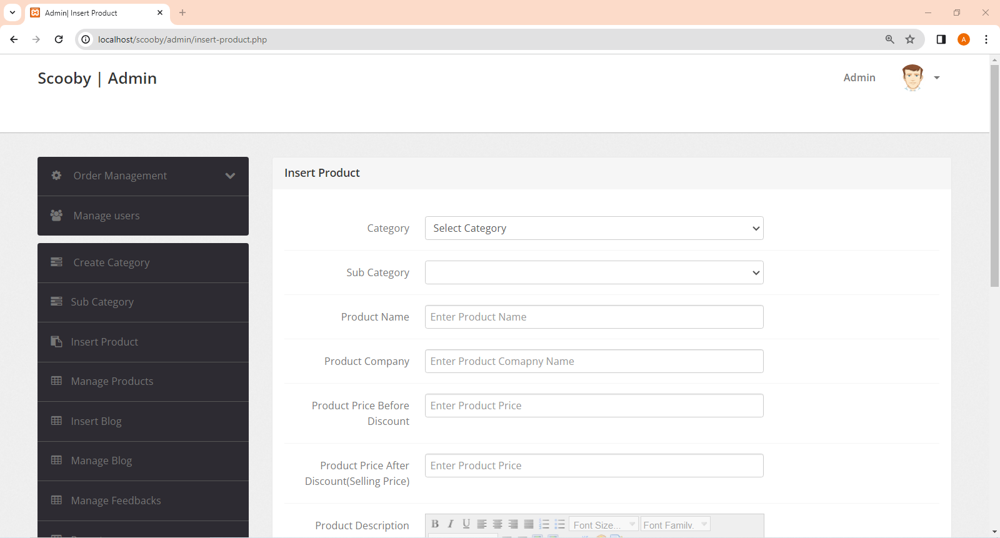

# 🐾 Scooby - Pet Care & Shop Website

A full-stack web application for a pet care and shop business, built as a bachelor's academic project.

## 🌐 Preview

### Home Page

### Shop Page

### Cart Page

### About Page

### Blog Page

### Contact Page

## 🔐 Admin Panel

### Admin Login

### Manage Users

### Category Management

### Product Management

## 🌟 Features
- User registration and login system
- Product shop with categories and subcategories
- Shopping cart and checkout
- Blog section
- Admin panel to manage:
  - Products & Categories
  - Blogs
  - Orders (pending/delivered)
  - Users & Feedbacks
  - Reports

## 🛠️ Tech Stack
- **Frontend:** HTML, CSS, Bootstrap, JavaScript, jQuery
- **Backend:** PHP
- **Database:** MySQL
- **Server:** Apache (XAMPP)

## ⚙️ Setup Instructions
1. Install XAMPP
2. Place the project folder in `C:\xampp\htdocs\scooby\`
3. Open phpMyAdmin at `localhost/phpmyadmin`
4. Create a database named `scooby`
5. Import `scooby.sql` into that database
6. Visit `localhost/scooby/` in your browser

## 🔑 Admin Panel Access
- **URL:** `localhost/scooby/admin/`
- **Username:** `admin`
- **Password:** `Test@123`

## 📄 Pages Included
- Home, About, Contact
- Shop, Shop Details, Cart, Checkout
- Blog Grid, Blog Standard, Blog Details
- Login, Sign Up, Forgot Password
- Gallery, FAQ, Pricing, Team
- Error 404 page
